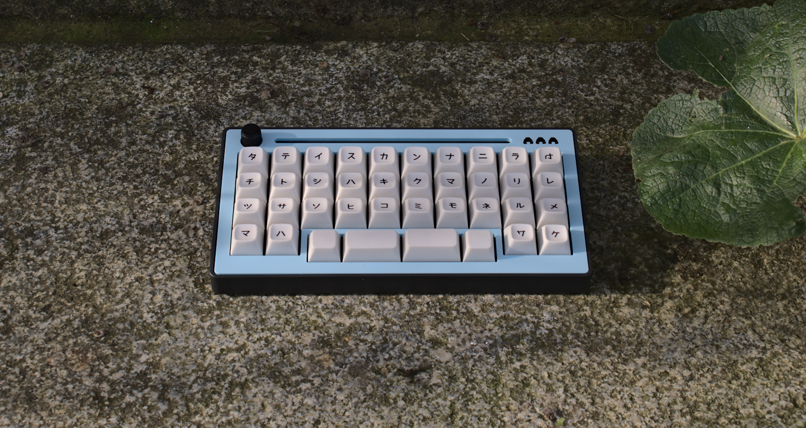
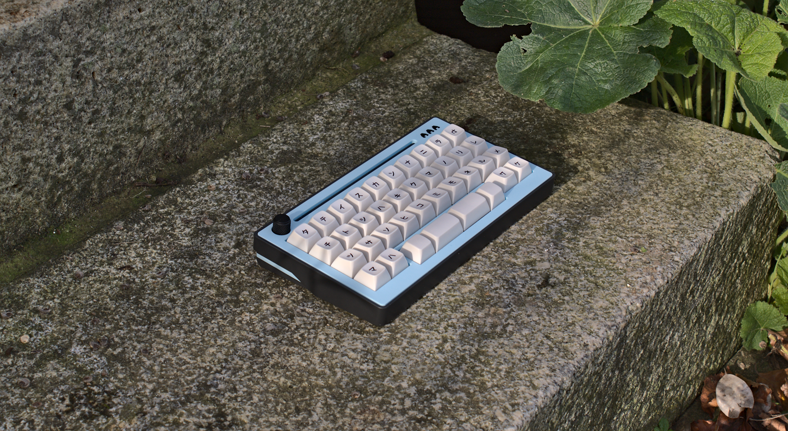
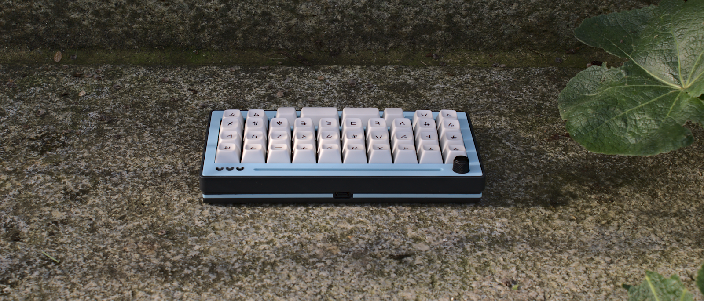

# SPC EVDR
38 key orthogonl keyboard w/ offset spacebar

## Features

- MX w/ hotswap
- encoder (12 mm knob diameter)
- OLED
- Bluetooth and USB connection
- case with optional acrylic accents
- case files are supplied (stl, dxf, as well as the freecad files)
- ZMK firmware support ( on Seeed Xiao SAMD21 or Seeed Xiao BLE )
- QMK firmware support ( on Seeed Xiao RP2040 )
- completely open source, permissive license

## Want one?
All production files you need to build your own board can be found [here](./prod).

Please see the [build instruction](prod/build_guide.md) for a more detailed listing of all things needed.

Gerber files as well as files needed for 3d printing are provided. Please note that the case design that supports the acryl layin may not be SLN printable. Please print them either in resin or nylon. I've used JLCPCBs printing service (black resin) and it turned out very good, so maybe take a look at that option.

### firmware 
The SPC EVDR uses ZMK firmware.

If you prefer the github workflow, you can find the zmk config [here](https://github.com/weteor/SPC_EVDR-Config).

## the rest
Everything in this repository is free to use however you might see fit. If you want to support me and my projects, please consider linking back to this repository if you build/change/use anything. 

If you would like to send me a tip, you could do it [here](https://ko-fi.com/weteor) (Please don't feel like you have to).

### some more images

