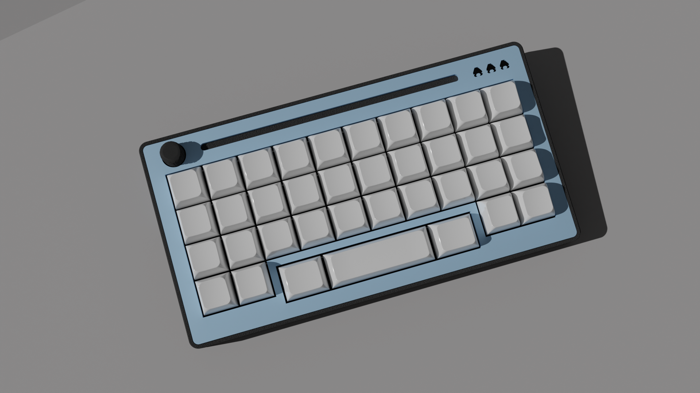
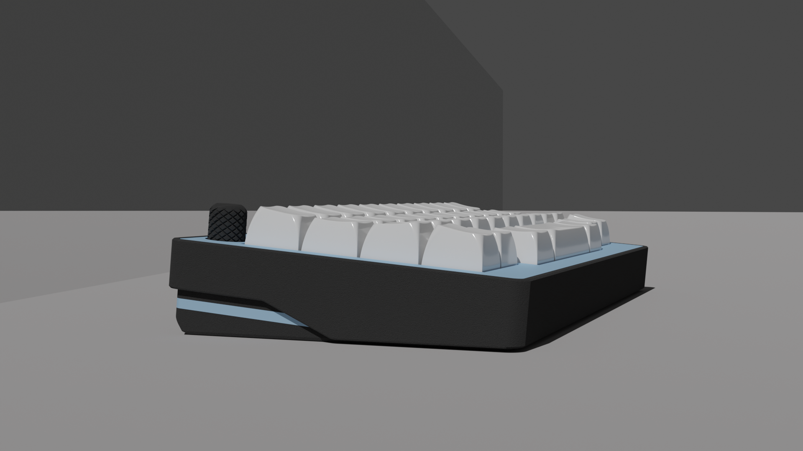
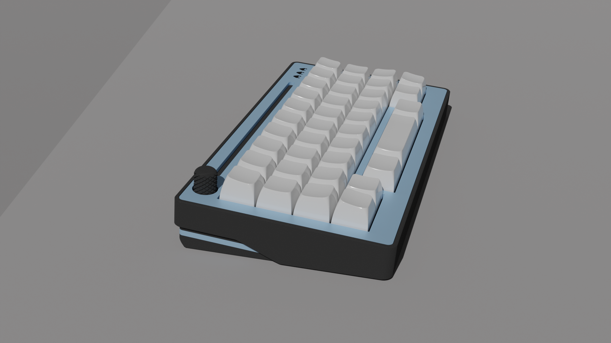

# SPC EVDR
38 key orthogonl keyboard w/ offset spacebar

## Features

- MX w/ hotswap
- encoder (12 mm knob diameter)
- OLED
- Bluetooth and USB connection 
- case files are supplied (stl, dxf, as well as the freecad files)
- ZMK firmware support
- completely open source, permissive license

## Want one?
All production files you need to build your own board can be found [here](./prod).

Please see the [build instruction](prod/build_guide.md) for a more detailed listing of all things needed.

Gerber files as well as files needed for 3d printing are provided. Please note that the case design that supports the acryl layin may not be SLN printable. Please print them either in resin or nylon. I've used JLCPCBs printing service (black resin) and it turned out very good, so maybe take a look at that option.

### firmware 
The SPC EVDR uses ZMK firmware.

If you prefer the github workflow, you can find the zmk config for the Tipper TF [here](https://github.com/weteor/SPC_EVDR-Config).

### some more renders

